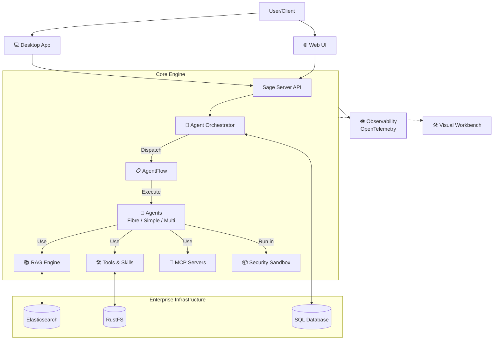

<div align="center">

# 🌟 **Experience Sage's Power**


[](README.md)
[](README_CN.md)
[](LICENSE)
[](https://python.org)
[](https://github.com/ZHangZHengEric/Sage)
[](https://deepwiki.com/ZHangZHengEric/Sage)
[](https://join.slack.com/t/sage-b021145/shared_invite/zt-3t8nabs6c-qCEDzNUYtMblPshQTKSWOA)

# 🧠 **Sage Multi-Agent Framework**

### 🎯 **Making Complex Tasks Simple**

> 🌟 **A production-ready, modular, and intelligent multi-agent orchestration framework for complex problem solving.**

</div>

---

## 📸 **Product Screenshots**

<div align="center">

<table>
  <tr>
    <td align="center" width="33%">
      
      <br/><strong>Visual Workbench</strong>
    </td>
    <td align="center" width="33%">
      
      <br/><strong>Real-time Collaboration</strong>
    </td>
    <td align="center" width="33%">
      
      <br/><strong>Multi-format Support</strong>
    </td>
  </tr>
</table>

</div>

> 📖 **Detailed Documentation**: [https://wiki.sage.zavixai.com/](https://wiki.sage.zavixai.com/)

---

## ✨ **Key Features**

- 🧠 **Multi-Agent Orchestration**: Support for **TaskExecutor** (Sequential), **FibreAgent** (Parallel), and **AgentFlow** (Declarative) orchestration modes.
- 🎯 **Maximized Model Capability**: Stable execution of complex tasks even on smaller models like **Qwen3.5 35B-A3B**, with framework-level optimizations unlocking model potential.
- 🧩 **Built-in High-Stability Skills**: Pre-installed production-ready Skills that work out of the box, ensuring reliable execution for critical tasks.
- 🛡️ **Secure Sandbox**: Isolated execution environment (`sagents.utils.sandbox`) for safe agent code execution.
- 👁️ **Full Observability**: Integrated **OpenTelemetry** tracing to visualize agent thought processes and execution paths.
- 🧩 **Modular Components**: Plug-and-play architecture for **Skills**, **Tools**, and **MCP Servers**.
- 📊 **Context Management**: Advanced **Context Budget** controls for precise token optimization.
- 💻 **Cross-Platform Desktop**: Native desktop apps for **macOS** (Intel/Apple Silicon), **Windows**, and **Linux**.
- 🛠️ **Visual Workbench**: Unified workspace for file preview, tool results, and code execution with 15+ format support.
- 🔌 **MCP Protocol**: Model Context Protocol support for standardized tool integration.

---

## 🚀 **Quick Start**

### Installation

```bash
git clone https://github.com/ZHangZHengEric/Sage.git
cd Sage
pip install -r requirements.txt
```

### Running Sage

**Desktop Application (Recommended)**:

Download the latest release for your platform:
- **macOS**: `.dmg` (Intel & Apple Silicon)
- **Windows**: `.exe` (NSIS Installer)
- **Linux**: Build from source

```bash
# macOS/Linux
app/desktop/scripts/build.sh release

# Windows
./app/desktop/scripts/build_windows.ps1 release
```

**Command Line Interface (CLI)**:
```bash
python app/sage_cli.py \
  --default_llm_api_key YOUR_API_KEY \
  --default_llm_model deepseek-chat \
  --default_llm_base_url https://api.deepseek.com
```

**Web Application (FastAPI + Vue3)**:

```bash
# Start backend
cd app/desktop/core
python main.py

# Start frontend (in another terminal)
cd app/desktop/ui
npm install
npm run dev
```

---

## 🏗️ **System Architecture**



---

## 📅 **What's New in v1.0.0**

### 🤖 **SAgents Kernel Updates**

- **Session Management Refactor**: Global `SessionManager` with parent-child session tracking
- **AgentFlow Engine**: Declarative workflow orchestration with Router → DeepThink → Mode Switch → Suggest flow
- **Fibre Mode Optimization**: 
  - Dynamic sub-agent spawning with `sys_spawn_agent`
  - Parallel task delegation with `sys_delegate_task`
  - Hour-level long-running task support
  - 4-level hierarchy depth control
  - Recursive orchestration capabilities
- **Lock Management**: Global `LockManager` for session-level isolation
- **Observability**: OpenTelemetry integration with performance monitoring

### 💻 **App Layer Updates**

- **Visual Workbench**: 
  - 20+ rendering components
  - 15+ file format support (PDF, DOCX, PPTX, XLSX, etc.)
  - List/Single view dual mode
  - Timeline navigation
  - Session-isolated state management
- **Cross-Platform Desktop**: 
  - macOS (Intel/Apple Silicon) - DMG
  - Windows - NSIS Installer
  - Linux - DEB support
- **Real-time Collaboration**: 
  - Message stream optimization
  - File reference extraction
  - Code block highlighting
  - Disconnect detection & resume
- **MCP Support**: Model Context Protocol for external tool integration

### 🔧 **Infrastructure**

- **Tauri 2.0**: Upgraded to stable version with new permission system
- **Build Optimization**: Rust caching, parallel builds, auto-signing
- **State Management**: Pinia store with session isolation

**[View Full Release Notes](release_notes/v1.0.0.md)**

---

## 📚 **Documentation**

- 📖 **Full Documentation**: [https://wiki.sage.zavixai.com/](https://wiki.sage.zavixai.com/)
- 📝 **Release Notes**: [release_notes/](release_notes/)
- 🏗️ **Architecture**: See `sagents/` directory for core framework
- 🔧 **Configuration**: Environment variables and config files in `app/desktop/`

---

## 🛠️ **Development**

### Project Structure

```
Sage/
├── sagents/                    # Core Agent Framework
│   ├── agent/                  # Agent implementations
│   │   ├── fibre/              # Fibre multi-agent orchestration
│   │   ├── simple_agent.py     # Simple mode agent
│   │   └── ...
│   ├── flow/                   # AgentFlow engine
│   ├── context/                # Session & message management
│   ├── tool/                   # Tool system
│   └── session_runtime.py      # Session manager
├── app/desktop/                # Desktop Application
│   ├── core/                   # Python backend (FastAPI)
│   ├── ui/                     # Vue3 frontend
│   └── tauri/                  # Tauri 2.0 desktop shell
└── skills/                     # Built-in skills
```

### Contributing

We welcome contributions! Please see our [GitHub Issues](https://github.com/ZHangZHengEric/Sage/issues) for tasks and discussions.

---

## 💖 **Sponsors**

<div align="center">

We are grateful to our sponsors for their support in making Sage better:

<table>
  <tr>
    <td align="center" width="33%">
      <a href="#" target="_blank">
        
      </a>
      <br/>
    </td>
    <td align="center" width="33%">
      <a href="#" target="_blank">
        
      </a>
    </td>
    <td align="center" width="33%">
      <a href="#" target="_blank">
        
      </a>
    </td>
  </tr>
</table>

</div>

---

## 🦌 **Join Our Community**

<div align="center">

### 💬 Connect with us

[](https://join.slack.com/t/sage-b021145/shared_invite/zt-3t8nabs6c-qCEDzNUYtMblPshQTKSWOA)

### 📱 WeChat Group


*Scan to join our WeChat community 🦌*

</div>

---

<div align="center">
Built with ❤️ by the Sage Team 🦌
</div>
