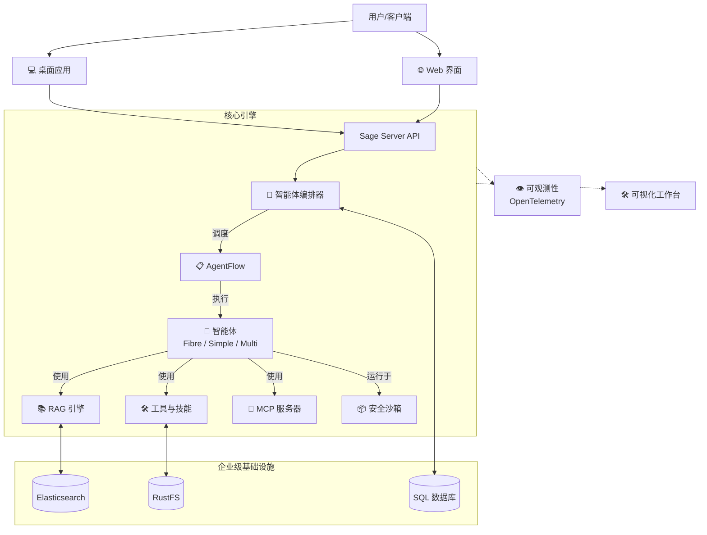

<div align="center">

# 🌟 **体验 Sage 的强大能力**


[](README.md)
[](README_CN.md)
[](LICENSE)
[](https://python.org)
[](https://github.com/ZHangZHengEric/Sage)
[](https://deepwiki.com/ZHangZHengEric/Sage)
[](https://join.slack.com/t/sage-b021145/shared_invite/zt-3t8nabs6c-qCEDzNUYtMblPshQTKSWOA)

# 🧠 **Sage 多智能体框架**

### 🎯 **让复杂任务变得简单**

> 🌟 **生产级、模块化、智能化的多智能体编排框架，专为复杂问题求解而生。**

</div>

---

## 📸 **产品截图**

<div align="center">

<table>
  <tr>
    <td align="center" width="33%">
      
      <br/><strong>可视化工作台</strong>
    </td>
    <td align="center" width="33%">
      
      <br/><strong>实时协作</strong>
    </td>
    <td align="center" width="33%">
      
      <br/><strong>多格式支持</strong>
    </td>
  </tr>
</table>

</div>

> 📖 **详细文档**: [https://wiki.sage.zavixai.com/](https://wiki.sage.zavixai.com/)

---

## ✨ **核心亮点**

- 🧠 **多智能体编排**：支持 **TaskExecutor** (串行)、**FibreAgent** (并行) 和 **AgentFlow** (声明式) 三种编排模式。
- � **模型能力最大化**：即使在 **Qwen3.5 35B-A3B** 等小模型上也能稳定完成复杂任务，框架级优化释放模型潜能。
- 🧩 **内置高稳定性 Skill**：预装多种经过实战验证的 Skill，开箱即用，确保关键任务稳定执行。
- 🛡️ **安全沙箱**：提供隔离执行环境 (`sagents.utils.sandbox`) 确保智能体代码执行安全。
- 👁️ **全链路可观测性**：集成 **OpenTelemetry** 追踪，可视化智能体思考与执行路径。
- 🧩 **模块化组件**：**Skills**、**Tools** 和 **MCP Servers** 的即插即用架构。
- 📊 **上下文管理**：先进的 **Context Budget** 控制，实现精准的 Token 优化。
- 💻 **跨平台桌面端**：原生桌面应用支持 **macOS** (Intel/Apple Silicon)、**Windows** 和 **Linux**。
- 🛠️ **可视化工作台**：统一的文件预览、工具结果和代码执行工作空间，支持 15+ 种格式。
- 🔌 **MCP 协议**：Model Context Protocol 支持，实现标准化工具集成。

---

## 🚀 **快速开始**

### 安装

```bash
git clone https://github.com/ZHangZHengEric/Sage.git
cd Sage
pip install -r requirements.txt
```

### 运行 Sage

**桌面应用（推荐）**：

下载适合您平台的最新版本：
- **macOS**: `.dmg` (Intel & Apple Silicon)
- **Windows**: `.exe` (NSIS 安装包)
- **Linux**: 从源码构建

```bash
# macOS/Linux
app/desktop/scripts/build.sh release

# Windows
./app/desktop/scripts/build_windows.ps1 release
```

**命令行工具 (CLI)**：
```bash
python app/sage_cli.py \
  --default_llm_api_key YOUR_API_KEY \
  --default_llm_model deepseek-chat \
  --default_llm_base_url https://api.deepseek.com
```

**Web 应用 (FastAPI + Vue3)**：

```bash
# 启动后端
cd app/desktop/core
python main.py

# 启动前端（在另一个终端）
cd app/desktop/ui
npm install
npm run dev
```

---

## 🏗️ **系统架构**



---

## 📅 **v1.0.0 更新内容**

### 🤖 **SAgents 内核更新**

- **Session 管理体系重构**：全局 `SessionManager`，支持父子会话关联追踪
- **AgentFlow 编排引擎**：声明式工作流编排，支持 Router → DeepThink → Mode Switch → Suggest 流程
- **Fibre 模式深度优化**：
  - `sys_spawn_agent` 动态子智能体生成
  - `sys_delegate_task` 并行任务委派
  - 支持小时级长时任务执行
  - 4 级层级深度控制
  - 递归编排能力
- **锁管理**：全局 `LockManager` 实现会话级隔离
- **可观测性**：OpenTelemetry 集成，支持性能监控

### 💻 **应用层更新**

- **可视化工作台**：
  - 20+ 渲染组件
  - 15+ 文件格式支持（PDF、DOCX、PPTX、XLSX 等）
  - 列表/单例双模式
  - 时间轴导航
  - 会话隔离的状态管理
- **跨平台桌面端**：
  - macOS (Intel/Apple Silicon) - DMG
  - Windows - NSIS 安装包
  - Linux - DEB 支持
- **实时协作**：
  - 消息流优化
  - 文件引用提取
  - 代码块高亮
  - 断开检测与恢复
- **MCP 支持**：Model Context Protocol 外部工具集成

### 🔧 **基础设施**

- **Tauri 2.0**：升级至稳定版，新的权限系统
- **构建优化**：Rust 缓存、并行构建、自动签名
- **状态管理**：Pinia Store 会话隔离

**[查看完整发布说明](release_notes/v1.0.0.md)**

---

## 📚 **文档资源**

- 📖 **完整文档**: [https://wiki.sage.zavixai.com/](https://wiki.sage.zavixai.com/)
- 📝 **发布说明**: [release_notes/](release_notes/)
- 🏗️ **架构说明**: 查看 `sagents/` 目录了解核心框架
- 🔧 **配置指南**: `app/desktop/` 目录下的环境变量和配置文件

---

## 🛠️ **开发**

### 项目结构

```
Sage/
├── sagents/                    # 核心智能体框架
│   ├── agent/                  # 智能体实现
│   │   ├── fibre/              # Fibre 多智能体编排
│   │   ├── simple_agent.py     # 简单模式智能体
│   │   └── ...
│   ├── flow/                   # AgentFlow 引擎
│   ├── context/                # 会话与消息管理
│   ├── tool/                   # 工具系统
│   └── session_runtime.py      # 会话管理器
├── app/desktop/                # 桌面应用
│   ├── core/                   # Python 后端 (FastAPI)
│   ├── ui/                     # Vue3 前端
│   └── tauri/                  # Tauri 2.0 桌面壳
└── skills/                     # 内置技能
```

### 参与贡献

我们欢迎贡献！请查看我们的 [GitHub Issues](https://github.com/ZHangZHengEric/Sage/issues) 了解任务和讨论。

---

## 💖 **赞助者**

<div align="center">

感谢以下赞助者对 Sage 的支持：

<table>
  <tr>
    <td align="center" width="33%">
      <a href="#" target="_blank">
        
      </a>
      <br/>
    </td>
    <td align="center" width="33%">
      <a href="#" target="_blank">
        
      </a>
    </td>
    <td align="center" width="33%">
      <a href="#" target="_blank">
        
      </a>
    </td>
  </tr>
</table>

</div>

---

## 🦌 **加入我们的社区**

<div align="center">

### 💬 与我们交流

[](https://join.slack.com/t/sage-b021145/shared_invite/zt-3t8nabs6c-qCEDzNUYtMblPshQTKSWOA)

### 📱 微信群


*扫码加入我们的微信社区 🦌*

</div>

---

<div align="center">
Built with ❤️ by the Sage Team 🦌
</div>
