

# Tool & Skill System

`sagents/tool/` and `sagents/skill/` form the "capability layer": they decide what an Agent can call during a session and how skill packages are loaded and executed.

## 1. Tool System `sagents/tool/`

### 1.1 Module Composition

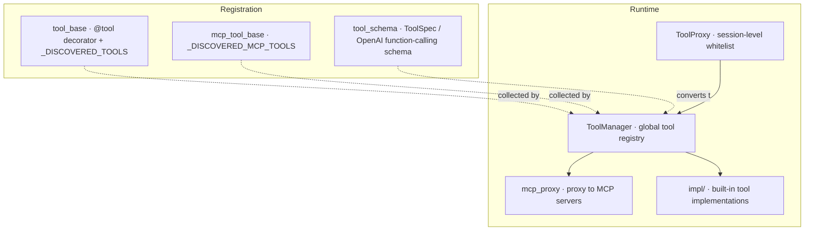


### 1.2 Two Classes of Tool Sources

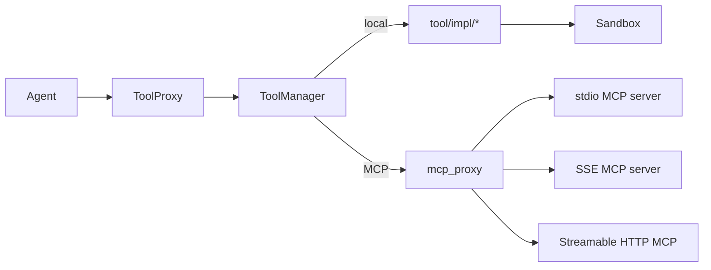


Whether a tool is local or comes from an MCP server, it looks the same to the Agent. `ToolManager` registers them uniformly and dispatches by call name.

### 1.3 ToolManager Capabilities

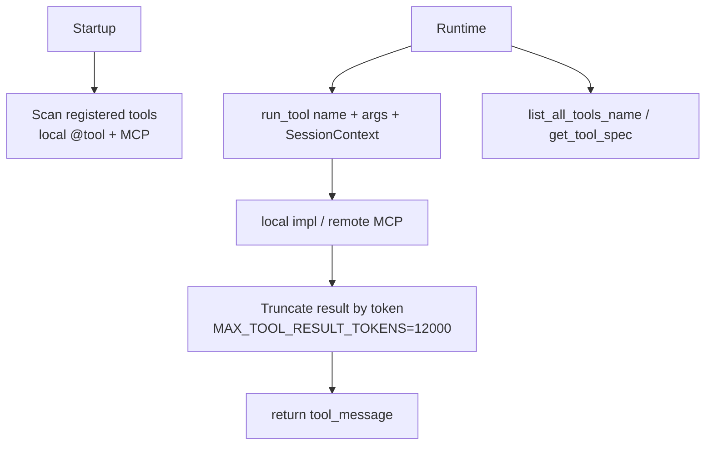


`ToolManager` is normally a process-level singleton, initialized at startup by `app/server/lifecycle.py` (or its desktop equivalent).

### 1.4 ToolProxy: Session-level Whitelist

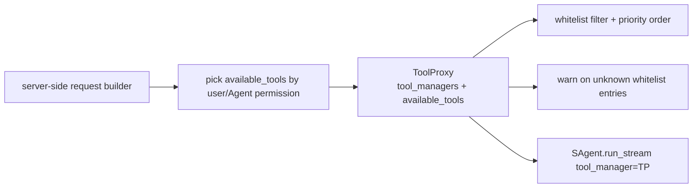


`ToolProxy` accepts multiple `ToolManager` instances (priority decreases along the list) and is interface-compatible with `ToolManager`, so the Agent does not have to distinguish between them.

### 1.5 Built-in Tools `tool/impl/`

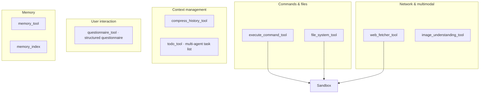


These are eventually executed against the `Sandbox` abstraction (see [Sandbox / LLM / Observability](ARCHITECTURE_SAGENTS_SANDBOX_OBS.md)).

### 1.6 MCP Integration

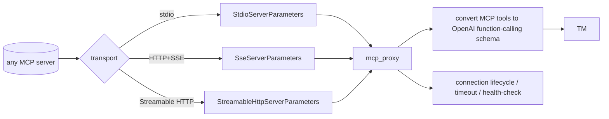


The bundled `mcp_servers/` directory is integrated the same way.

## 2. Skill System `sagents/skill/`

A "tool" is a function-grained capability; a "skill" is a coarser-grained workflow: a directory, a description, optional scripts and asset files.

### 2.1 Module Composition

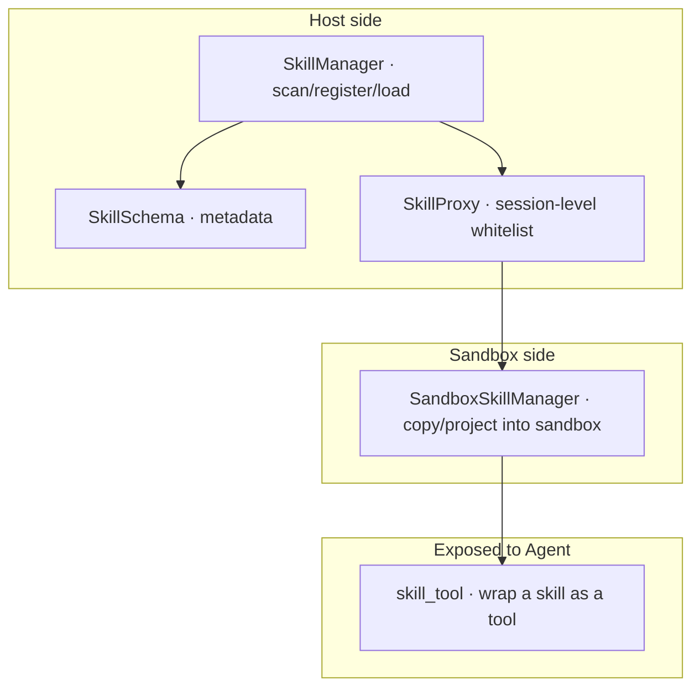


### 2.2 Data Flow

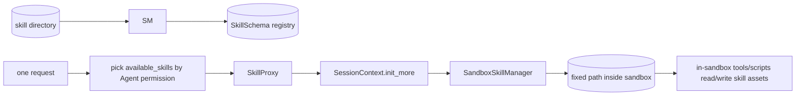


`SkillManager` is **not** responsible for copying skills into the sandbox – that is the job of `SandboxSkillManager`. This separation lets remote sandboxes use skills as well.

### 2.3 Skill → Tool

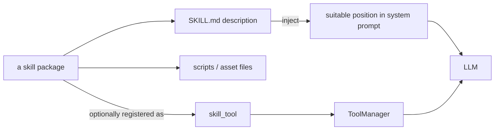


A skill can both shape model behavior via its description and be invoked by the LLM as a function call.

## 3. Recommendation / Selection Strategy

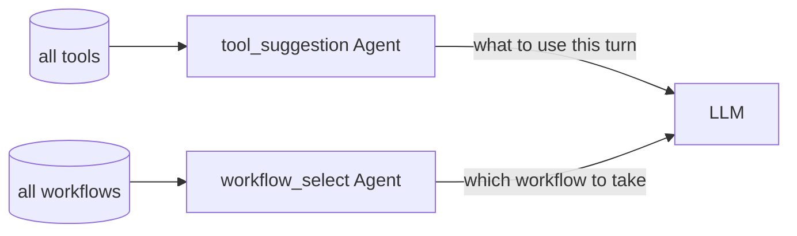


The tool/skill layer answers "what is available"; suggestion Agents answer "what should we use this turn", so we don't have to stuff every schema into the context.

## 4. Startup vs Runtime

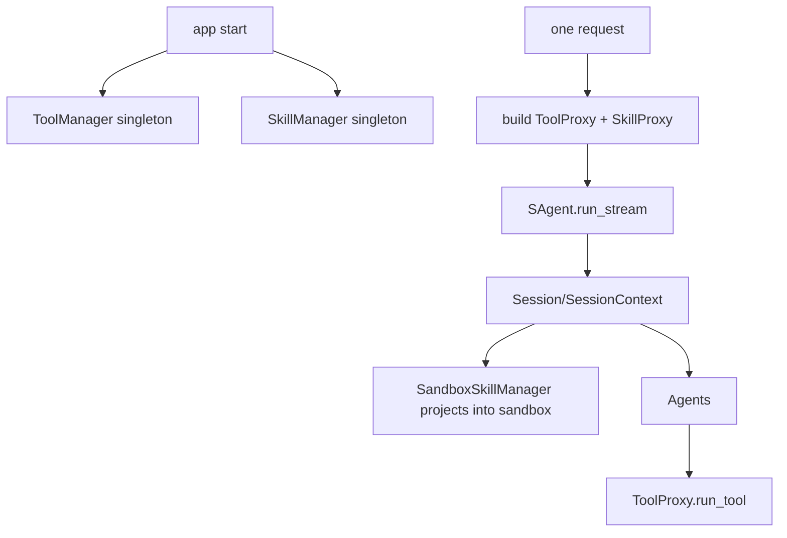


## 5. Extending: Custom Tool / MCP / Skill

Most extension points of Sage live in these two layers. The three common ways to give an Agent more capabilities are independent of each other.

### 5.1 Write a Local Tool

```python
# my_pkg/my_tools.py
from sagents.tool.tool_base import tool

@tool(
    name="get_weather",
    description="Look up the weather of a city",
)
async def get_weather(city: str) -> dict:
    """Returning a dict is enough; the framework serializes it into a tool_message."""
    return {"city": city, "temp_c": 23, "condition": "sunny"}
```

As long as this module is imported into the process (e.g. inside `app/server/bootstrap.py` during tool initialization), it will be auto-collected by `ToolManager`.

### 5.2 Wire In an MCP Server

```python
from mcp import StdioServerParameters
from sagents.tool.tool_schema import SseServerParameters, StreamableHttpServerParameters

# Pick one of the three transports as needed:
stdio_cfg = StdioServerParameters(command="my-mcp", args=["--stdio"])
sse_cfg = SseServerParameters(url="https://mcp.example.com/sse")
http_cfg = StreamableHttpServerParameters(url="https://mcp.example.com/mcp")

# Register through whatever API tool_manager.py currently exposes
tool_manager.register_mcp_server(name="my_mcp", params=stdio_cfg)
```

After registration, every tool exposed by that MCP server is auto-converted to OpenAI function-calling schema and is treated identically to local tools.

### 5.3 Author a Skill Package

A skill is a directory with a conventional layout:

```text
my_skill/
├── SKILL.md          # required, human-readable "how to use", injected into the LLM
├── skill.yaml        # optional metadata: id / name / description / activation scenarios
├── scripts/          # optional scripts that may run inside the sandbox
└── assets/           # optional static assets
```

`SKILL.md` typically starts with:

```markdown
# Skill: My Skill

## Purpose
What problem this skill solves, when to use it.

## Steps
1. ...
2. ...

## Notes
- ...
```

Then register the parent directory with `SkillManager`:

```python
from sagents.skill import SkillManager

skill_manager = SkillManager()
skill_manager.add_skill_dir("/path/to/skills_root")
```

For a given session, scope the visible skills with `SkillProxy(skill_manager, available_skills=["my_skill"])` and pass it into `SAgent.run_stream`.

---

## 12. Tool live-progress channel (tool_progress)

Long-running tools (notably blocking `execute_shell_command`) often need to
push intermediate output to the UI before the tool finishes, without polluting
the final tool message that goes to the LLM. Sage adopts the same "two event
types" approach as Codex App Server / Claude Code:

- **`message` events**: unchanged. The complete tool result (with structured
  fields like `exit_code`, `stdout`, `stderr`) is appended to MessageManager,
  persisted, and fed back to the LLM.
- **`tool_progress` events**: a new pure-progress channel **for the UI only**.
  These events never enter MessageManager, are not persisted, and are not sent
  to the LLM.

### How a tool emits progress

```python
from sagents.tool import emit_tool_progress

@tool(name="my_long_tool", description="...")
async def my_long_tool(...):
    async for chunk in some_stream():
        await emit_tool_progress(chunk, stream="stdout")  # safe no-op when not in a chat session
    return {"content": "...final structured result..."}
```

- `emit_tool_progress(text, stream="stdout"|"stderr"|"info")` is a fire-and-
  forget API. Outside a chat context (CLI / unit tests / legacy callers) it
  silently no-ops, so the tool's behaviour is unchanged.
- Tool signature and return value require **no changes**; MCP tools are
  unaffected.

### Wire format

A new event type is added to the NDJSON stream:

```json
{
  "type": "tool_progress",
  "tool_call_id": "call_abc",
  "text": "...incremental output...",
  "stream": "stdout",
  "closed": false,
  "ts": 1761700000.123
}
```

- `tool_call_id` ties each chunk back to the originating assistant tool_call;
  the frontend aggregates by this key.
- `closed: true` marks the end of the progress stream so the UI can drop the
  spinner.
- The existing `message` event shape is fully preserved; downstream consumers
  that don't care about `tool_progress` can simply ignore it.

### Coalescing / throttling

`emit_tool_progress` coalesces by `(tool_call_id, stream)` using a time window
to prevent high-frequency small writes from saturating the channel:

| Trigger | Behaviour |
| --- | --- |
| Another emit on the same stream < 50ms after the previous one | Append to in-memory buffer, do not enqueue yet |
| Time window elapses (default 50ms) | Buffer is merged into a single `tool_progress` event and enqueued |
| Per-stream accumulated bytes ≥ 16KB | Flush immediately, even if the window hasn't elapsed |
| `emit_tool_progress_closed()` | Force-flush all pending streams under the current `tool_call_id`, then emit `closed=True` |
| `unregister_progress_queue()` (chat ends) | Cancel pending flush tasks; remaining buffer is discarded |

Tunables:

- `SAGE_TOOL_PROGRESS_FLUSH_INTERVAL_MS` (default `50`). Set to `0` to disable
  coalescing and emit immediately.
- `SAGE_TOOL_PROGRESS_FLUSH_BYTES` (default `16384`).

Coalescing is lock-free and safe within a single event loop: the `flush_task`
is scheduled with `asyncio.create_task`, subsequent emits reuse the same task,
and a synchronous flush (byte threshold or close) cancels the task—so an event
is never enqueued twice.

### Disabling

Set `SAGE_TOOL_PROGRESS_ENABLED=false` to make `emit_tool_progress` a global
no-op. The UI then only sees the final result once the tool returns; all other
behaviour is unchanged.

### Key modules

| Module | Purpose |
| --- | --- |
| `sagents/tool/tool_progress.py` | protocol constants, `contextvars` binding, `emit_tool_progress` |
| `sagents/agent/agent_base.py` | binds `tool_progress` context inside `_execute_tool` |
| `common/utils/stream_merge.py` | `interleave_message_and_progress` merges both event streams into NDJSON |
| `common/services/chat_service.py` | registers / unregisters progress queues, forwards `tool_progress` |
| `app/server/web/src/composables/chat/useChatPage.js` | frontend dispatcher for `type=tool_progress` into the workbench |
| `app/server/web/src/components/chat/workbench/renderers/toolcall/ShellCommandToolRenderer.vue` | live-output area rendered per stream |