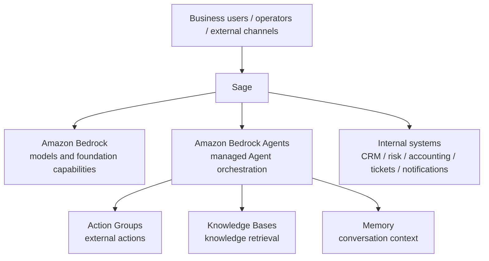



# Sage, Amazon Bedrock, and Bedrock Agents

> Note: This document keeps the language simple and explains three things: what each platform is, how they differ, and how they fit together.  
> Core point: **Sage is the more complete business application platform, Amazon Bedrock provides model capabilities, and Amazon Bedrock Agents hosts an Agent on AWS. Sage and Bedrock Agents overlap in the Agent delivery layer and do compete there, but Sage covers much more than Agents alone.**

---

## 1. What Each One Is

### Sage

Sage is our business platform. It focuses on making work actually happen, and it is more than just an Agent layer. It does not just run a conversation or a single call; it covers the full business path from entry, handling, state, and tools to writeback and audit. The parts that should be automated can be automated, the parts that should go to a human can be handed off, and the rules and context can all be managed in one place.

In other words, Sage is not just about "can we run an Agent"; it is about "how the whole business runs reliably."

### Amazon Bedrock

Amazon Bedrock is AWS's model platform. Think of it as the model foundation used by applications. Its job is to make model access, model choice, and safe model usage on AWS straightforward.

### Amazon Bedrock Agents

Amazon Bedrock Agents is AWS's managed Agent service. Think of it as "an AWS service that runs an Agent for you." Its job is to set up and run an Agent on AWS, then let that Agent call external actions, connect to knowledge bases, remember context, and keep the task moving at runtime.

It is an AWS-managed Agent runtime, not a complete business platform.

If you only look at the Agent layer, Sage can also cover many of the same needs: entry, state, tool calls, knowledge access, memory, routing, writeback, and audit.  
That is where the overlap comes from. The difference is that Bedrock Agents is an AWS-managed product, while Sage is our own business platform that can place those capabilities into a much larger business flow.

---

## 2. One Diagram for the Separation of Concerns

Sage owns the business flow.  
Bedrock owns the model.  
Bedrock Agents owns the AWS-hosted Agent.  
Internal systems own the real business data and actions.

---

## 3. Differences

This table is more useful. Read across for the product, and down for the capability. The first half is about business-layer needs, and the second half is about model-layer needs:

| Capability | Sage | Amazon Bedrock | Amazon Bedrock Agents |
|------|------|----------------|----------------------|
| Call external actions | Yes | Not directly | Yes |
| Connect knowledge sources | Yes | Not directly | Yes |
| Remember context | Yes | Not a full business-context layer | Yes |
| Manage business state | Strong | No | Only the Agent's own context |
| Connect business systems | Strong | Not directly | Indirectly through action groups |
| Do business orchestration | Strong | No | Partial, and usually narrow in scope |
| Handle writeback and audit centrally | Strong | No | Partial; usually needs business-platform support |
| Call and switch models | Yes, through integration | Strong | Supported, but usually not the main focus |
| Do model generation and extraction | Yes, through model calls | Strong | Supported, depending on the selected model |
| Control model safety and runtime | Indirectly | Strong | Partly, but still depends on Bedrock |
| Act as the model foundation | Not the main focus | Strong | Not the main focus |

One-line version:

- **Sage supports these business capabilities and can also connect to model capabilities, but its main job is to run the business.**
- **Bedrock mainly provides model capability and acts as the application's model foundation.**
- **Bedrock Agents supports some business capabilities too, but it is still primarily an AWS-managed Agent runtime.**

From a product perspective, Sage and Bedrock Agents compete in the Agent delivery layer.  
But Sage is the broader business platform, so many things Bedrock Agents can do can also be done in Sage, and then placed inside a fuller business workflow.

### 3.1 Why They Look Similar but Are Not the Same Thing

They look similar because both deal with:

- Agents
- Instructions
- Tools / actions
- Knowledge
- Conversation context

But the level is different:

- **Bedrock Agents** is about running an Agent on AWS.
- **Sage** is about making the business flow work end to end, while also fitting with systems, governance, and human collaboration.

So yes, the names overlap, but the job is different.

Because of that, Sage and Bedrock Agents are not just upstream/downstream. They overlap in the "Agent application platform" layer.  
To be objective: Bedrock Agents can be used on its own to build Agent apps. Sage can also provide this capability, while covering a more complete business delivery stack.

---

## 4. How Sage Works with Them

### 4.1 Sage + Bedrock

This is the most common pattern.

Sage handles:

- User entry
- Session and state
- Business workflow
- Tool calls
- Tasks and writeback
- Audit and observability

Bedrock handles:

- Model inference
- Response generation
- Structured extraction
- Planning

In this pattern, Sage runs the business and Bedrock provides the model.

### 4.2 Sage + Bedrock Agents

This pattern is a good fit for small, standardized subprocesses, such as:

- Standard Q&A
- Controlled API action chains
- Fixed knowledge retrieval plus response generation
- AWS-managed orchestration for a subtask

Sage can call Bedrock Agents as an external capability through a tool or service boundary.  
In most cases, the recommended approach is:

- **Keep the main business orchestration in Sage**
- **Use Bedrock Agents only for narrow, well-bounded subprocesses**

If the customer only needs a fairly standard Agent, Bedrock Agents can be used directly.  
If the customer wants a complete business platform, Sage can already carry the Agent capability itself, without handing over control.

### 4.3 Recommended Order

Usually the safest order is:

1. Let Sage run the business flow.
2. Let Sage call Bedrock for model inference.
3. Bring in Bedrock Agents only when AWS-managed Agent orchestration is clearly useful.

That keeps business control in Sage.

### 4.4 When Bedrock Agents Alone Is Enough

If you only need a standard Agent with a fixed workflow and a few tools, Bedrock Agents can be enough. Typical examples:

- Internal FAQ
- Standardized knowledge Q&A
- Small-scope automation assistants
- Simple knowledge retrieval + response generation
- Scenarios that do not need complex business state or multi-channel coordination

### 4.5 When Sage Is the Better Fit

If your goal is real business delivery instead of a single Agent demo, Sage is usually the better fit because it is built for:

- Multi-entry access
- Long-running conversation flows
- Tasks and automation
- Customer context services
- Internal system orchestration
- Human collaboration
- Audit, replay, and writeback

### 4.6 A Practical Collaboration Pattern

In real projects, the most practical pattern is:

- **Sage as the control plane**
- **Bedrock as the model layer**
- **Bedrock Agents only for narrow, clearly bounded subprocesses**

That gives you AWS-managed Agent capability without giving up business-flow control.  
If the project goal is "use a more complete platform to run the business," Sage is usually the main platform, rather than handing the main Agent over to Bedrock Agents.

### 4.7 Selection Guide

If you are still deciding, the quickest way is:

| Situation | Better fit |
|------|----------|
| You only need a standard Agent with a fixed workflow and a small number of tools | Bedrock Agents |
| Your main goal is real business delivery, multi-entry access, long-running collaboration, writeback, and audit | Sage |
| Your main goal is model inference, generation, and structured extraction | Bedrock |
| You only want AWS-managed Agent orchestration for a narrow subprocess | Sage + Bedrock Agents |

One-line summary:

- **Bedrock Agents is a managed runtime for standardized Agents.**
- **Sage is a broader business application platform, and Agents are only one part of it.**
- **They can be used together, but Sage is already a stronger option in the Agent delivery layer.**

---

## 5. What Usually Blocks Real Delivery

### 5.1 Business context is not automatic

Bedrock and Bedrock Agents do not magically know who the customer is, what stage they are in, or which fields matter.  
You still need:

- A customer context service
- CRM / risk / accounting integration
- Stage definitions
- State synchronization

### 5.2 Agent boundaries are easy to blur

If too much is delegated to Bedrock Agents, you quickly get:

- Overlapping responsibilities
- Unclear ownership of the final decision
- Harder debugging and accountability

That is one reason Sage is a better main orchestration plane.

### 5.3 Tools and actions need governance

Real business actions are not just "call an API". You still need to handle:

- Idempotency
- Permissions
- Approval
- Rollback
- Audit
- Exception recovery

Without that, Agents become risky automation.

### 5.4 System integration is harder than model integration

In many projects, the real bottleneck is not the model. It is:

- Connecting the CRM
- Mapping risk fields
- Aligning accounting data
- Closing the loop on tickets / notifications / handoff
- Maintaining business rules

The model platform is the starting point; system integration is the real battlefield.

### 5.5 Cost, latency, and governance rise together

Once you have multiple models, multiple Agents, and multiple tools, common issues include:

- Higher latency
- Higher cost
- Prompt / tool version drift
- Non-deterministic behavior
- Weak observability

These must be governed at the Sage layer, not handled separately in each Agent.

---

## 6. Recommendations for Sage

1. **Keep Sage as the main business control plane.**
2. **Make sure Sage has a clear replacement path in the Agent delivery layer, instead of binding the main capability to Bedrock Agents.**
3. **Use Bedrock as the model and generation foundation.**
4. **Use Bedrock Agents only for narrow, clearly bounded workflows, or as an external capability when that is useful.**
5. **Keep customer context, business rules, writeback, and audit under Sage control.**
6. **Focus on system integration, state synchronization, and governance before increasing the number of Agents.**

---

## 7. References

- [Amazon Bedrock Overview](https://docs.aws.amazon.com/bedrock/latest/userguide/what-is-bedrock.html)
- [How Amazon Bedrock Agents works](https://docs.aws.amazon.com/bedrock/latest/userguide/agents-how.html)
- [Use action groups to define actions for your agent to perform](https://docs.aws.amazon.com/bedrock/latest/userguide/agents-action-create.html)
- [Retain conversational context across multiple sessions using memory](https://docs.aws.amazon.com/bedrock/latest/userguide/agents-memory.html)
- [Enable agent memory](https://docs.aws.amazon.com/bedrock/latest/userguide/agents-configure-memory.html)
