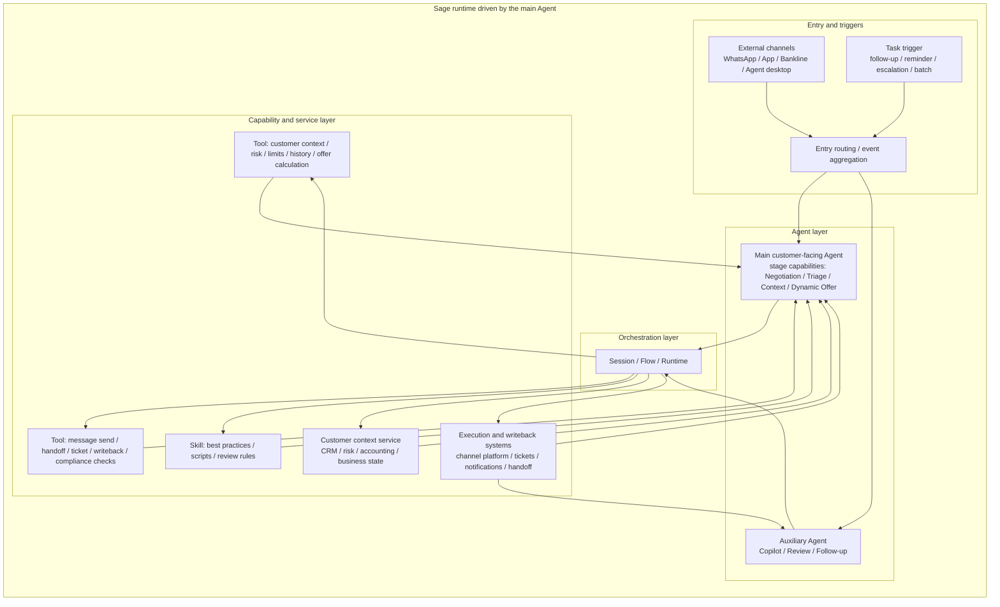



# Sage Platform Multi-Agent Delivery Recommendation

> Note: This document is not a rejection of the customer proposal. It reframes the same business goals in a way that fits the Sage Platform delivery model.  
> Core point: **the customer's capability goals are valid, but not every capability needs to become a separate Agent. A more practical design is a single customer-facing main Agent, supported by stage state, system context, and tools/skills/tasks.**

---

## 1. Executive Summary

The customer's proposal is trying to solve four things:

1. Keep a consistent customer context across multiple channels.
2. Let the system adapt the next action based on customer state.
3. Keep compliance, protection, audit, and review always on.
4. Give human agents complete, explainable, traceable context when escalation is needed.

Sage can do all of this, but the implementation model should be:

- **One customer-facing main Agent** responsible for session handling, routing, state, and audit.
- **Tools / Skills / Tasks** for deterministic work.
- **Platform primitives** for managing Agents, Tools, Skills, Tasks, and channel integrations.

In other words, Sage should not "flatten 9 Agents into the product." It should use the platform to make **one primary customer Agent** effective, controlled, and extensible.

---

## 2. What Sage Already Has

Sage is already a full intelligent-agent collaboration platform, not a single chat app. The reusable building blocks include:

| Module | Role in Sage | Good fit for |
|------|---------------|--------------|
| Agent management | Create, configure, and edit Agents | Decision-making, negotiation, complex reasoning |
| Tool management | Unified integration for built-in tools, MCP, browser automation, file capability | Querying, writing, external actions |
| Skill management | Reusable playbooks and workflows | Scripts, rules, domain knowledge, standard procedures |
| Task management | One-off and recurring tasks | Follow-up, reminders, review, batch execution |
| Session / Memory | Session state and long-term memory | Customer context, stage state, history |
| Multi-entry access | Web, desktop, CLI, browser extension, IM | Customer, operator, and internal process entry points |
| Workbench / observability | Inspect files, tool output, workflow traces | Audit, review, issue diagnosis, delivery visibility |

This means many modules in the customer proposal are already covered by existing Sage platform primitives. The point is not to build a second platform. The point is to attach business capabilities to Sage's existing execution model.

---

## 3. Recommended Sage Execution Model

### 3.1 Main Execution Flow

This diagram only shows one thing: **external channels and Tasks trigger the main Agent or auxiliary Agents first, and the Agent then goes through the orchestration layer to call Tools, Skills, and internal services**. It is an execution-flow diagram, not a flat architecture poster.

### 3.2 Design Principles

1. **Data lookup should be a Tool first**  
   Customer profile, risk segmentation, repayment ability, payment history, and channel state should be deterministic queries or computations, not something a separate Agent "figures out" every time.

2. **Method should be a Skill first**  
   Collections scripts, protection policies, triage rules, review templates, and operator prompts are ideal Skills.

3. **Scheduled work should be a Task first**  
   Due-date reminders, overdue follow-up, review checks, periodic outreach, and pre-breach monitoring should live in the task system.

4. **Keep the entry surface to one main Agent**  
   Triage, Self-Service, and Negotiation are better treated as stage capabilities of the same Agent, not as parallel entry Agents.

5. **Orchestration and state belong to the platform layer**  
   Context, session, audit, message flow, and routing should be owned by Sage's orchestration layer, not scattered across business scripts.

---

## 4. Mapping the Customer Proposal to Sage

The table below remaps the customer's "9 capability points" into a Sage-native model centered around **one main customer-facing Agent**.

| Customer capability | Sage recommendation | Ownership | What Sage provides | What the customer provides |
|------------|----------------|----------|------------------|------------------|
| Orchestrator Agent | Platform orchestration / runtime | Sage platform leads | Session, Flow, routing, audit, handoff, context management | Stage definitions, routing rules, handoff policy |
| Context and Diagnosis Agent | Customer context service + diagnosis task | Joint, with customer leading business content | Context aggregation, state cache, diagnosis trigger, audit | Customer profile, risk tags, repayment ability, history, internal diagnosis rules, CRM-like customer context MCP server |
| Negotiator Agent | Main customer-facing Agent | Sage provides the main framework, customer contributes scripts and policy | Main Agent template, tool calls, session management, multi-turn dialogue | Collections scripts, negotiation boundaries, policy wording, acceptable settlement rules |
| Dynamic Offer Agent | Offer decision engine | Joint, with customer leading business logic | Offer calculation framework, tool integration, explanation capability, observability | Offer rules, rate/term/down-payment strategy, internal constraints, approval boundaries |
| Triage and Self-Service Agent | Self-service / triage capability | Joint, but more accurately a capability module of the main Agent | Entry triage Skill/Workflow, intent classification, self-service Q&A | Intent taxonomy, front-end business rules, self-service scope |
| Human Agent Copilot | Agent collaboration | Customer leads the operator workflow; Sage provides generic capabilities | Operator view, context summary, history replay, writeback | Operator SOPs, handling rules, script requirements, display priority |
| Sentiment and Protection Agent | Message compliance and protection checks | Customer-led rules, enforced inside the send/reply path | Pre-send checks, audit, interception points, risk markers | Protection tags, sensitive wording, compliance boundaries, escalation rules |
| Post-Agreement Adherence Agent | Follow-up and reminders | Sage platform leads the technical framework; customer provides business cadence | Task, notifications, state tracking, automated follow-up, reminders | Follow-up cadence, SLA, breach warning rules, follow-up strategy |
| Compliance and Quality Agent | Review and feedback loop | Joint | Review Skills, observability data, sampling pipeline, review tasks | Compliance standards, scoring rules, sample set, improvement criteria |

### 4.1 Division of Responsibilities

At a higher level, the responsibilities split into three groups:

| Role | Best fit for | Notes |
|------|--------------|------|
| Sage platform | Orchestration, session, tool framework, skill framework, tasks, audit, handoff, observability | This is the platform foundation and should stay generic |
| Customer | Internal data, internal systems, domain rules, collections knowledge, compliance wording, operator workflows | These are customer assets and must come from the customer |
| Joint delivery | Business orchestration, offer rules, entry strategy, protection strategy, review loop | This part needs both platform capabilities and customer domain knowledge |

In plain language:

- The platform provides the generic foundation.
- The customer provides the business inputs.
- Both sides together design the actual workflow.

### 4.2 A Single Main Entry Agent

One key point in this proposal is:

- **Negotiator is the main customer-facing Agent, and the only external entry point.**
- **Triage and Self-Service are not separate Agents.** They are front-end capabilities implemented as Skills or Workflows of the main Agent.
- **Dynamic Offer is not a new entry identity.** It is the offer optimization capability used by the main Agent during negotiation.

So these are not three peer entry Agents. They are **stage capabilities of one main entry Agent**:

- Triage first identifies "what do you want?"
- Dynamic Offer decides "what is the best offer?"
- Negotiator handles "how do we close the conversation?"

### 4.3 Customer Context and Diagnosis

This part deserves special clarification:

- Context and diagnosis are not created from thin air. On both Sage and the customer side, there should be a CRM-like customer context MCP server that serves customer profile, risk tags, history, business stage, and other facts.
- Diagnosis is a capability built on top of the context service. When customer data changes, a state transition happens, or key fields are updated, the system can trigger an event or task to refresh diagnosis, stage, risk signals, and next-best-action suggestions.

This means the customer context service is the source of truth, and Sage consumes it through tools and orchestration.

---

## 5. Sage Delivery Layers

### 5.1 Unified Entry

All external channels enter the Sage customer-facing surface first, where the platform handles:

- Session creation
- Context binding
- Main Agent selection
- Audit trace capture
- Handoff decision

### 5.2 Main Agent Decisioning

The main Agent is responsible for:

- Determining the current business stage
- Choosing which Tool to call
- Deciding whether a Skill is needed
- Deciding whether a Task should be triggered
- Deciding whether to hand off to a human

`Triage / Self-Service / Negotiation` should be viewed as stage states or capability combinations of the same Agent, not as separate parallel Agents.

### 5.3 Deterministic Actions via Tools

Recommended tool candidates:

- Customer information lookup
- Risk and protection marker lookup
- Installment / amount / rate / offer calculation
- Script template retrieval
- Message sending
- Ticket creation
- Handoff
- CRM / channel writeback

### 5.4 Time-Based Work via Tasks

Recommended task candidates:

- Due-date reminders
- Overdue follow-up
- Review and escalation checks
- Periodic outreach
- Periodic reporting

---

## 6. Suggested Delivery Waves

### Wave 1: One Core Path

- One main customer-facing Agent
- A core set of Tools
- Context and audit
- One handoff path

The goal is to make the core digital journey work first, rather than splitting the architecture too early.

### Wave 2: Offer and Protection

- Protection tags
- Compliance checks
- Sentiment / risk detection
- Offer calculation
- Operator support view

### Wave 3: Skills and Automation

- Convert high-frequency scripts, rules, and review methods into Skills
- Turn follow-up, reminders, and review into Tasks
- Recycle operational knowledge into reusable platform assets

---

## 7. Final Takeaway

The customer's capability goals are valid. The important part is the delivery shape.

If we do it the Sage way, the answer is:

- **Platform manages the generic foundation**
- **The main Agent handles the customer conversation**
- **Tools handle deterministic actions**
- **Skills handle knowledge and method**
- **Tasks handle time-driven operations**

That gives us a cleaner architecture, better reuse, easier governance, and a more reliable delivery path.

