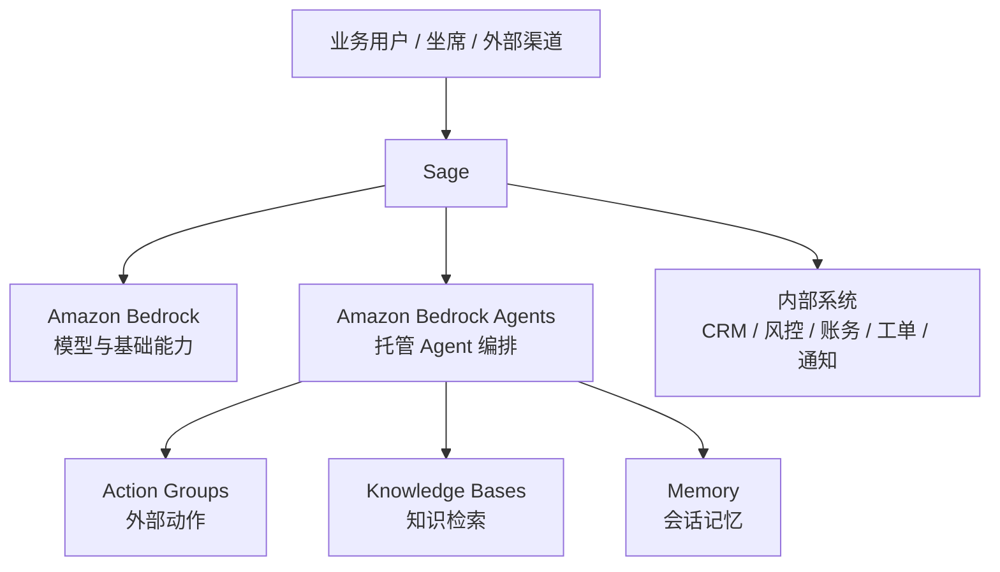



# Sage、Amazon Bedrock 与 Bedrock Agents

> 说明：这篇文档尽量用大白话讲清楚三件事：它们分别是什么、有什么不同、怎么一起用。  
> 核心判断：**Sage 是更完整的业务应用平台，Amazon Bedrock 负责提供模型能力，Amazon Bedrock Agents 负责在 AWS 里托管一个 Agent。Sage 和 Bedrock Agents 在“Agent 落地”这一层有重叠，也有竞争关系；但 Sage 的覆盖面更广，不只做 Agent。**

---

## 1. 三者分别是什么

### Sage

Sage 是我们自己的业务平台。它更关注“怎么把事情做成”，而且不只是一层 Agent。它管的不只是一个对话或一次调用，而是从入口、处理、状态、工具、回写到审计的一整条业务链路。该自动的地方自动，该转人工的地方转人工，所有规则和上下文也都能统一管理。

换句话说，Sage 不只是“能不能跑一个 Agent”，而是“整个业务怎么稳定跑起来”。

### Amazon Bedrock

Amazon Bedrock 是 AWS 的模型平台。你可以把它理解成“给应用用的大模型底座”。它更像是把模型这件事做好，让应用能方便地调用、切换和安全使用模型。

### Amazon Bedrock Agents

Amazon Bedrock Agents 是 AWS 提供的 Agent 托管服务。你可以把它理解成“在 AWS 上帮你跑一个 Agent 的服务”。它的重点是把一个 Agent 在 AWS 里配置起来、运行起来，并在运行过程中去调用外部动作、接知识库、记住上下文、推进任务。

它更像一个 AWS 托管的 Agent 运行环境，不是完整的业务平台。

如果只看“Agent 这一层”，Sage 也能做很多同类事情：入口、状态、工具调用、知识接入、记忆、路由、回写、审计。  
所以这两者在 Agent 交付层会有重叠。区别在于，Bedrock Agents 是 AWS 的托管产品，Sage 是我们自己的业务平台，能把这整层能力放进更完整的业务场景里。

---

## 2. 一张图看分工

Sage 负责业务入口和流程。  
Bedrock 负责模型。  
Bedrock Agents 负责 AWS 里的 Agent 托管。  
内部系统负责真实业务数据和动作。

---

## 3. 它们的差异点

下面这张表更实用，横向看三个产品，纵向看常见能力。前半部分看业务层，后半部分看模型层：

| 能力点 | Sage | Amazon Bedrock | Amazon Bedrock Agents |
|------|------|----------------|----------------------|
| 调用外部动作 | 支持 | 不直接负责 | 支持 |
| 接入知识库 | 支持 | 不直接负责 | 支持 |
| 记住上下文 | 支持 | 不直接负责完整业务上下文 | 支持 |
| 管理业务状态 | 强 | 不负责 | 只管 Agent 自己的上下文 |
| 连接业务系统 | 强 | 不直接负责 | 通过 action groups 间接连接 |
| 做业务编排 | 强 | 不负责 | 支持一部分，但范围较窄 |
| 统一回写和审计 | 强 | 不负责 | 部分支持，通常还要靠业务平台补齐 |
| 调用和切换模型 | 支持，通过集成来做 | 强 | 支持，但通常不是重点 |
| 做模型生成和抽取 | 支持，通过模型调用来做 | 强 | 支持，依赖所选模型 |
| 控制模型安全和运行环境 | 间接支持 | 强 | 部分支持，最终仍依赖 Bedrock |
| 作为模型底座 | 不是重点 | 强 | 不是重点 |

一句话：

- **Sage 支持这些业务能力，也能接模型能力，但重点是把业务跑起来。**
- **Bedrock 主要提供模型能力，是应用的模型底座。**
- **Bedrock Agents 也支持一部分业务能力，但更偏 AWS 托管 Agent 运行环境。**

从产品关系上看，Sage 和 Bedrock Agents 在 Agent 交付层是有竞争关系的。  
但 Sage 更像一个更大的业务平台，很多 Bedrock Agents 能做的事，Sage 也能做，而且还能把这些能力放进更完整的业务流程里。

### 3.1 为什么看起来像，但不是一回事

它们看起来像，是因为都在处理同一类问题：

- 让 Agent 做事
- 让 Agent 记住上下文
- 让 Agent 调工具

但它们的重点不一样：

- **Bedrock Agents** 关心“这个 Agent 怎么在 AWS 里跑起来”
- **Sage** 关心“这个 Agent 怎么放进真实业务里跑通、跑久、跑稳，并且和业务系统、流程、治理、人工协同一起工作”

所以它们会有相似的名词，但不是同一个层次。

也正因为这样，Sage 和 Bedrock Agents 不是简单的上下游关系，而是会在“Agent 应用平台”这一层发生重叠。  
客观地说，Bedrock Agents 可以单独做 Agent 应用；同样客观地说，Sage 也可以提供这类能力，并且覆盖更完整的业务交付。

---

## 4. Sage 怎么和它们协作

### 4.1 Sage + Bedrock

这是最常见的组合。

Sage 负责：

- 用户入口
- 会话与状态
- 业务流程
- 工具调用
- 任务和回写
- 审计和观测

Bedrock 负责：

- 模型推理
- 生成回复
- 抽取结构化信息
- 规划下一步动作

这种模式下，Sage 管业务，Bedrock 管模型。

### 4.2 Sage + Bedrock Agents

这个模式适合边界清楚、动作固定的小流程，例如：

- 标准化问答
- 受控的 API 动作链
- 固定的知识检索 + 结果生成
- 需要 AWS 托管编排的子任务

Sage 可以把 Bedrock Agents 当成一个外部能力来调用。  
但通常建议：

- **主业务编排留在 Sage**
- **边界清楚、标准化的子流程才交给 Bedrock Agents**

如果客户只需要一个比较标准的 Agent，Bedrock Agents 可以直接上。  
如果客户要的是一个完整的业务平台，Sage 本身就能承接 Agent 能力，而且不会把控制权让出去。

### 4.3 推荐顺序

通常建议的顺序是：

1. 先让 Sage 把业务流程跑起来
2. 再让 Sage 调 Bedrock 用模型
3. 最后再看哪些小流程适合交给 Bedrock Agents

这样最稳，不会一开始就把业务控制权交出去。

### 4.4 什么时候只用 Bedrock Agents 就够了

如果你只是想做一个边界清楚、流程固定、工具不多的标准 Agent，Bedrock Agents 可能就够了，例如：

- 内部 FAQ
- 标准化知识问答
- 小范围自动化助手
- 简单的知识检索 + 结果生成
- 不需要复杂业务状态和多渠道协同的场景

### 4.5 什么时候 Sage 更合适

如果你做的是业务交付，而不是单个 Agent Demo，Sage 往往更合适，因为它更擅长承接：

- 多入口接入
- 长流程会话
- 任务和自动化
- 客户上下文服务
- 内部系统编排
- 人工协同
- 审计、回放、回写

### 4.6 一个更实用的协作方式

在实际项目里，最推荐的方式通常是：

- **Sage 做总控**
- **Bedrock 提供模型**
- **Bedrock Agents 只承接边界清晰的子流程**

这样既保留了 AWS 托管 Agent 的能力，也不丢掉 Sage 对业务流程的控制力。  
如果项目目标是“用一个更完整的平台把业务真正跑起来”，那通常会优先让 Sage 做主平台，而不是把主 Agent 交给 Bedrock Agents。

### 4.7 选型建议

如果你还在判断怎么选，可以直接看下面这几条：

| 情况 | 更适合谁 |
|------|----------|
| 只想做一个标准 Agent，流程固定，工具不多 | Bedrock Agents |
| 目标是真实业务交付，多入口、长流程、回写、审计都要有 | Sage |
| 目标主要是模型推理、生成和抽取 | Bedrock |
| 只想把一小段流程交给 AWS 托管 Agent | Sage + Bedrock Agents |

一句话总结：

- **Bedrock Agents 更像一个托管 Agent 运行环境。**
- **Sage 更像一个更完整的业务应用平台，Agent 只是其中一部分。**
- **两者可以一起用，但在 Agent 交付这一层，Sage 本身就是一个更强的选项。**

---

## 5. 真实业务里最容易遇到的阻碍

### 5.1 业务上下文不是自动就有

Bedrock 和 Bedrock Agents 都不会天然知道你的客户是谁、处在哪个阶段、哪些字段是关键。  
所以你仍然需要：

- 客户上下文服务
- CRM / 风控 / 账务数据接入
- 业务阶段定义
- 状态同步机制

### 5.2 Agent 边界很容易画不清

如果把太多职责交给 Bedrock Agents，容易出现：

- 主 Agent 和子 Agent 职责重叠
- 谁负责最终收口不清楚
- 出问题时不好追责

这也是 Sage 更适合作为主编排层的原因。

### 5.3 工具和动作需要治理

真实业务里的动作不是“调用一下 API”这么简单。  
还要处理：

- 幂等性
- 权限
- 审批
- 回滚
- 审计
- 异常补偿

如果这些没设计好，Agent 再聪明也会变成高风险自动化。

### 5.4 内部系统接入比模型接入更难

很多项目真正卡住的地方不是模型，而是：

- CRM 接口怎么接
- 风控字段怎么解释
- 账务数据怎么对齐
- 工单 / 通知 / 转人工怎么闭环
- 业务规则谁来维护

所以，模型平台只是起点，业务集成才是主战场。

### 5.5 成本、延迟和治理会一起上来

多模型、多 Agent、多工具之后，常见问题会包括：

- 延迟变长
- 调用成本上升
- Prompt / Tool 版本漂移
- 行为不可预测
- 可观测性不足

这些问题需要在 Sage 层统一治理，而不是分散在每个 Agent 里。

---

## 6. 给 Sage 的建议

1. **Sage 保持为主业务控制平面。**
2. **Sage 在 Agent 交付层要有明确的替代能力，不把主能力绑定到 Bedrock Agents 上。**
3. **Bedrock 作为模型和生成能力的底座。**
4. **Bedrock Agents 只用于边界清晰、托管价值明确的子流程，或者作为对外协作的外部能力。**
5. **客户上下文、业务规则、回写和审计继续由 Sage 统一管理。**
6. **真实落地优先解决系统集成、状态同步和治理，而不是先堆 Agent 数量。**

---

## 7. 参考链接

- [Amazon Bedrock Overview](https://docs.aws.amazon.com/bedrock/latest/userguide/what-is-bedrock.html)
- [How Amazon Bedrock Agents works](https://docs.aws.amazon.com/bedrock/latest/userguide/agents-how.html)
- [Use action groups to define actions for your agent to perform](https://docs.aws.amazon.com/bedrock/latest/userguide/agents-action-create.html)
- [Retain conversational context across multiple sessions using memory](https://docs.aws.amazon.com/bedrock/latest/userguide/agents-memory.html)
- [Enable agent memory](https://docs.aws.amazon.com/bedrock/latest/userguide/agents-configure-memory.html)
