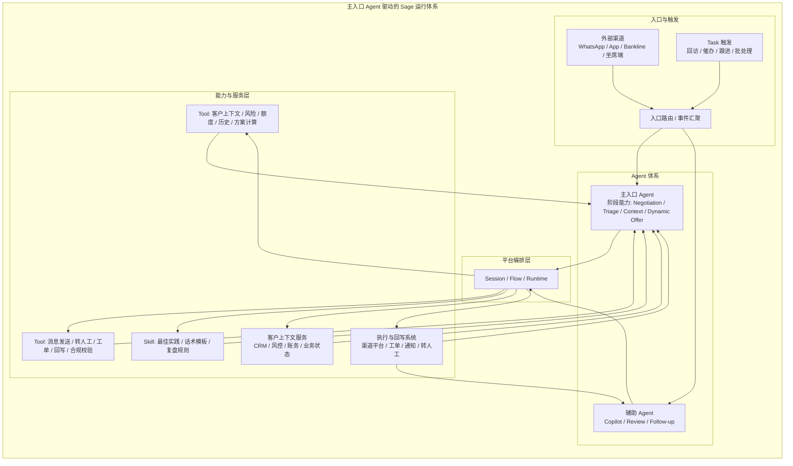



# Sage 平台视角下的多 Agent 落地建议

> 说明：本文不是对客户原方案的否定，而是把其中正确的业务诉求，改写成更符合 Sage Platform 的实现方式。  
> 核心判断：**客户提出的功能点大体是对的，但实现上不需要把每一项都做成独立 Agent。更合理的方式是：一个主客户入口 Agent，配合阶段状态、系统上下文和工具/技能/任务来完成不同目标。**

---

## 1. 结论先行

客户的提案本质上想解决四件事：

1. 让用户在多个渠道里保持同一份上下文。
2. 让系统能根据客户状态动态给出下一步动作。
3. 让合规、保护、审计、复盘这些能力始终在线。
4. 让人工坐席在需要介入时，能够拿到完整、可解释、可追踪的上下文。

这四件事在 Sage 里都能做，但方式应当是：

- **一个主客户入口 Agent**，负责会话、路由、状态和审计。
- **大量 Tool / Skill / Task 承担确定性工作**。
- **通过统一的平台模块来管理 Agent、工具、技能、任务和渠道接入**。

换句话说，Sage 不是“把 9 个 Agent 平铺出来”，而是“用平台能力把一个主入口 Agent 编排得足够专业、足够可控”。  
这也是本文的核心建议。

---

## 2. Sage 已经具备的模块

Sage 平台本身已经不是单点聊天应用，而是一个完整的智能体协作平台。当前可直接复用的能力包括：

| 模块 | Sage 中的角色 | 适合承载什么 |
|------|---------------|--------------|
| Agent 管理 | 配置、创建、编辑不同职责的 Agent | 对话决策、策略判断、复杂推理 |
| Tool 管理 | 统一接入内置工具、MCP、浏览器自动化、文件能力 | 查询、写入、调用外部系统、执行动作 |
| Skill 管理 | 可复用的经验包与工作流程包 | 话术、规则、领域知识、标准流程 |
| Task 管理 | 一次性任务与循环任务 | 催办、提醒、复查、定时回访、批处理 |
| Session / Memory | 会话状态与长期记忆 | 客户上下文、阶段信息、历史记录 |
| 多入口接入 | Web、桌面、CLI、Chrome 扩展、IM | 客户、坐席、运营和内部流程接入 |
| 工作台 / 可观测性 | 查看文件、工具输出、流程痕迹 | 审计、复盘、问题定位、结果交付 |

这意味着，很多客户在提案里单独画出来的模块，在 Sage 里其实已经有对应的承载面了。  
所以重点不是“再造一套平台”，而是“把业务能力挂到 Sage 现有平台机制上”。

---

## 3. Sage 的推荐实现方式

### 3.1 总体执行链路

下面这张图只表达一件事：**外部渠道和 Task 先触发主入口 Agent / 辅助 Agent，Agent 再经过平台编排层去调用 Tool / Skill / 内部服务**。  
它是一个执行链路图，不是把所有模块平铺展开的总览图。

### 3.2 设计原则

1. **能查数据的，优先做 Tool**  
   客户画像、风险分层、还款能力、历史账单、渠道状态，这些都应该是确定性的查询或计算能力，而不是每次都交给一个单独 Agent 去“想”。

2. **能沉淀方法的，优先做 Skill**  
   例如催收话术、保护策略、分流规则、复盘模板、人工坐席提示语，适合做成可复用 Skill。

3. **能定时执行的，优先做 Task**  
   例如到期提醒、复核、未完成跟进、定期回访、坏账前预警，都应该交给任务系统。

4. **入口尽量收敛到一个主 Agent**  
   Triage、Self-Service、Negotiator 更适合做成同一个 Agent 的不同阶段 / 能力组合，而不是多个并列入口 Agent。

5. **编排和状态归平台层管理**  
   上下文、会话、审计、消息流转、路由，都应由 Sage 的统一编排机制承接，而不是散落在各个业务脚本里。

---

## 4. 客户功能点与 Sage 的映射

下表把客户提案中的“9 个能力点”改写成 Sage 里以**一个主入口 Agent**为中心的真实落地方式。

| 客户功能点 | 在 Sage 里怎么做 | 建议实现 |
|------------|------------------|----------|
| Orchestrator Agent | 平台统一编排层，而不是业务 Agent | 由 Session / Flow / Runtime 负责路由、状态和审计 |
| Context and Diagnosis | 主入口 Agent 的上下文与诊断能力，底层由客户上下文 MCP Server + Tool 支撑 | 优先工具化，结果回写到会话上下文 |
| Negotiator Agent | 主客户入口 Agent（唯一对外入口） | 负责对话推进、协商、收口确认 |
| Dynamic Offer | 主入口 Agent 调用的方案优化能力 | 负责给出更优的方案组合、期限、首付、话术包装 |
| Triage and Self-Service | 主入口 Agent 的前置自助/分流能力，通常由 Skill/Workflow 承载 | 负责意图识别、问题分流、自助服务入口 |
| Human Agent Copilot | 坐席辅助视图 + 上下文整理 Tool | 重点是“展示完整上下文”，不是重新造一个聊天 Agent |
| Sentiment and Protection | 消息发送/回复生成 Tool 内的合规拦截能力 | 在发消息、给结论、做拒绝时进行校验和兜底 |
| Post-Agreement Adherence | Task + Notification Tool | 定时提醒、复查、预警、回访 |
| Compliance and Quality | 质检 Skill + 观测数据 + 离线任务 | 用于复盘、统计、抽检和持续优化 |

这张表的核心意思是：

- **对外只有一个主入口 Agent。**
- **客户想要的能力可以保留。**
- **但不需要全部用 Agent 的形态实现。**
- **Sage 里，Tool / Skill / Task 反而更适合承载大量确定性工作。**

这里还有一个关键区分：

- **上下文与诊断不是凭空“想”出来的。**不管是 Sage 还是客户侧实现，都应该有一个类似 CRM 的客户上下文 MCP Server，用来提供客户画像、风险标签、历史状态、业务阶段等基础信息。
- **诊断是建立在上下文服务之上的能力。**当客户信息被更新、状态变化、关键字段变更时，可以通过事件或任务触发自动诊断，更新当前阶段、风险提示和后续动作建议。

- **`Negotiator` 是主客户入口 Agent**，也是唯一对外入口，目标是把对话推进到达成、确认和收口。
- **`Triage and Self-Service` 不是另一个独立 Agent，而是这个主 Agent 的前置能力/Skill/Workflow**，目标是识别意图、分流问题、帮助客户进入正确路径。
- **`Dynamic Offer` 不是新的入口身份，而是主 Agent 在协商阶段调用的方案优化能力**，目标是根据客户状态和当前上下文，动态调整首付、期限、话术包装和方案组合。

所以这三个东西不是三个并列入口，而是**一个主入口 Agent 的三个阶段能力**：

- `Triage` 先判断“你要什么”
- `Dynamic Offer` 决定“给你什么方案更合适”
- `Negotiator` 负责“把这件事谈成并落地”

### 4.1 分工原则

如果再往前走一步，真正需要写清楚的不是“功能名”，而是“谁来提供什么”。  
建议把能力分成三类：

| 角色 | 更适合负责什么 | 说明 |
|------|----------------|------|
| Sage 平台方 | 编排、会话、工具框架、技能框架、任务、审计、转人工、观测 | 这是平台底座，应该尽量通用化 |
| 客户方 | 内部数据、内部系统、行业规则、催收知识、合规口径、坐席流程 | 这些内容强依赖客户资产，必须由客户提供 |
| 联合共建 | 业务编排、方案规则、入口策略、保护策略、质检闭环 | 这部分既需要平台能力，也需要客户知识 |

更直白地说：

- **平台方提供通用底座。**
- **客户方提供业务输入。**
- **双方一起完成真正的业务编排。**

### 4.2 按原始 9 个能力点对齐

下面按原始文档的 9 个能力点逐项对齐，同时给出我们建议的 Sage 模块名。重点不是“名字保不保留”，而是“我们认为它在 Sage 里应该长成什么样，以及谁来主导”。

| 原始能力点 | Sage 建议模块名 | 主责归属 | Sage 平台提供什么 | 客户方需要提供什么 |
|------------|----------------|----------|------------------|------------------|
| Orchestrator Agent | 平台编排层 / 运行时 | Sage 平台方主导 | Session、Flow、路由、审计、转人工、上下文管理 | 业务阶段定义、路由规则、转人工策略 |
| Context and Diagnosis Agent | 客户上下文服务 + 诊断任务 | 联合共建，客户主导业务内容 | 上下文汇总、状态缓存、诊断触发、审计 | 客户画像、风险标签、还款能力、历史记录、内部诊断规则、客户上下文 MCP Server |
| Negotiator Agent | 主入口对话 Agent | Sage 平台方提供主框架，客户参与话术与规则 | 主业务 Agent 模板、工具调用、会话管理、多轮对话能力 | 催收话术、谈判边界、政策口径、可接受的协议规则 |
| Dynamic Offer Agent | 方案决策引擎 | 联合共建，客户主导业务逻辑 | 方案计算框架、Tool 接入、结果解释能力、可观测性 | 方案规则、利率/期数/首付策略、内部约束、审批边界 |
| Triage and Self-Service Agent | 自助分流能力 / 自助模式 | 联合共建，但更准确地说是主入口 Agent 的能力模块 | 入口分流 Skill/Workflow、意图识别、自助问答能力 | 意图分类标准、前置业务规则、可自助处理范围 |
| Human Agent Copilot | 坐席协同 | 客户主导坐席流程，平台提供通用能力 | 坐席视图、上下文汇总、历史回放、结果回写 | 坐席 SOP、人工处理规范、话术要求、展示字段优先级 |
| Sentiment and Protection Agent | 消息合规校验 | 客户主导规则，平台把它放在消息发送与回复生成链路里 | 消息生成前校验、审计、拦截点、风险标记 | 保护标签、敏感话术、合规边界、升级处理规则 |
| Post-Agreement Adherence Agent | 履约跟进 | Sage 平台方主导技术框架，客户提供业务节奏 | Task、通知、状态追踪、自动回访、提醒 | 回访节奏、SLA、违约预警规则、跟进策略 |
| Compliance and Quality Agent | 质检复盘闭环 | 联合共建 | 质检 Skill、观测数据、抽检流水线、复盘任务 | 合规标准、评分规则、质检样本、改进标准 |

### 4.3 一句话总结

这 9 个能力点里：

1. **平台方最适合主导的是编排、状态、执行和观测。**
2. **客户方最适合主导的是业务规则、内部数据、合规口径、知识内容。**
3. **最容易成功的是联合共建的部分，因为它们既需要平台能力，也需要客户资产。**

---

## 5. 建议的 Sage 落地分层

### 5.1 第一层：统一入口

所有外部渠道先进入 Sage 的统一会话入口，由平台负责：

- 建立 Session
- 绑定客户上下文
- 选择主 Agent
- 记录审计轨迹
- 决定是否转人工

### 5.2 第二层：主 Agent 负责决策

主 Agent 不负责所有事情，而是负责：

- 判断当前属于哪个业务阶段
- 决定调用哪个 Tool
- 决定是否启用某个 Skill
- 决定是否触发 Task
- 决定是否转交坐席

这里建议把 `Triage / Self-Service / Negotiation` 视为同一个主 Agent 的阶段状态或能力组合，而不是多个并列 Agent。  
其中 `Triage and Self-Service` 更适合做成主入口 Agent 的 Skill / Workflow；阶段的切换可以由 `system context`、`session state`、`workflow stage` 来驱动。

### 5.3 第三层：工具化承载确定性动作

建议把这些能力优先工具化：

- 客户信息查询
- 风险和保护标记查询
- 分期 / 金额 / 利率 / 方案计算
- 话术模板读取
- 消息发送
- 工单创建
- 转人工
- 回写 CRM / 渠道系统

### 5.4 第四层：任务化承载时序动作

建议把这些能力交给 Task：

- 到期提醒
- 逾期跟进
- 复查和催办
- 周期性回访
- 阶段性报告

---

## 6. 推荐的交付路径

### Wave 1：先做一条主链路

- 一个主业务 Agent
- 一组核心 Tool
- 一套上下文和审计
- 一个转人工出口

目标是先跑通最核心的数字化链路，而不是一开始就把架构拆得太碎。

### Wave 2：补充策略和保护能力

- 保护标签
- 合规拦截
- Sentiment / Risk 判断
- 动态方案计算
- 坐席辅助视图

### Wave 3：沉淀技能与自动化

- 把高频话术、判断规则和复盘方法沉淀成 Skill
- 把跟进、催办、复查做成 Task
- 把经验回收成平台可复用资产

---

## 7. 最重要的一句话

客户提出的功能点基本是合理的，问题不在“想法对不对”，而在“怎么落地”。

如果按 Sage 的方式来做，应该是：

- **平台层统一管理模块**
- **Agent 负责策略和决策**
- **Tool 负责确定性动作**
- **Skill 负责知识和方法**
- **Task 负责时间驱动动作**

这样做的好处是：架构更清楚、复用更高、治理更容易、交付更稳。
